# Toaster_GUI_Simulator_LVGL
Desktop PC Simulation of Toaster Embedded GUI implemented with LVGL running on an ESP32 
The GUI is controlled on the ESP32 by an encoder with a push button. To simulate this the mouse scroll wheel and its click is used on the pc.

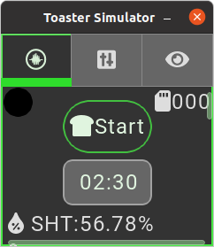
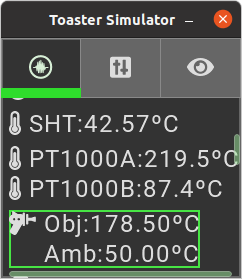
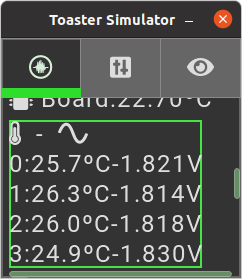
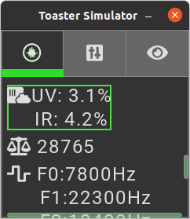
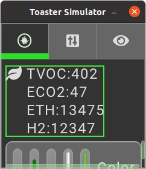
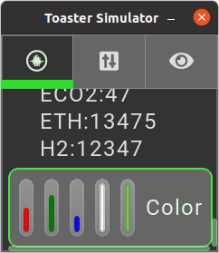
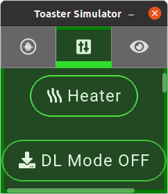
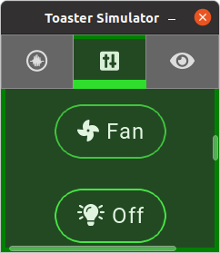
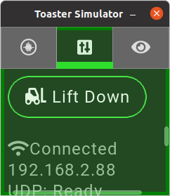
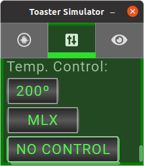
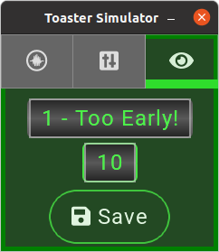
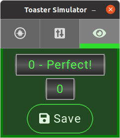

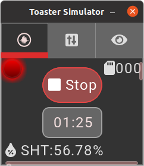

